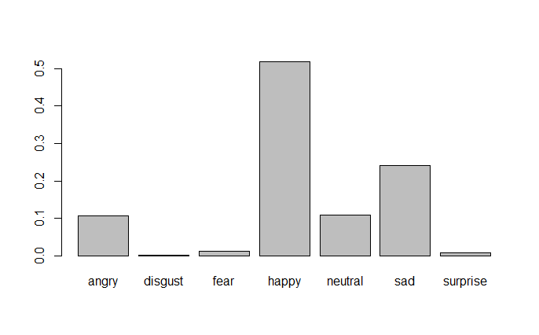

# Speech

# Emotion/gender examples:

Guided back-prop

# Transcript
00:00:00 needs to move their jobs overseas by going to a territorial tax system we want to present and we'll change the tax code to Great incentives for people to invest in communities that have been left behind that is a bipartisan idea 
00:00:15 we want a president we want a president who will change how the government contracts so that it only does business in places that have been left behind economically that is a bipartisan idea instead of ramming down the throat of the American people 
00:00:30 a tax bill that is based on people lying and selling out we need a president to watch to use the tax code to take care of places that have been left behind cuz that's Our obligation need a president who's going to look into the future 
00:00:45 understand what Thomas Friedman's talking about in his book he understands that the world is changing and we need to do something about it we need to make our country more entrepreneurial cuz that's how you succeed in the future we need to make our country more competitive and import 
00:01:00 we need a new social contract the social contract that I succeeded on needs to change we need to repent preparing our kids for totally new world people going to need to be trained across their lives and one job anymore 
00:01:15 going to have for 5 Healthcare in retirement can no longer be linked to employment cuz as long as it is people won't move their job leave their jobs and pursue opportunities right that's the kind of President and that's the kind of leadership 
00:01:30 we need we need a president who doesn't want to repeal the estate tax but wants to expand the Earned Income Tax Credit a bipartisan idea 
00:01:45 what we really need a president to do is to bring us together to restore civility to politics to restore respect for the profession of Public Service  
00:02:00 can actually begin a dialogue about the things we agree on instead of always always talking about the things we don't agree on present 
00:02:15 you said it well in Baltimore Maryland in 1958 he said we shouldn't seek the Democratic answer or the Republican answer we should seek the right answer that's the kind of President we need 
00:02:30 and it is not only as a matter of substance the right answer for this country but it is as a matter of Politics the right position for the Democratic Party 
00:02:45 We Believe government can and should do transformative things to lift up our people take care of those that are left behind and prepare us for the future so how can we not become the party 
00:03:00 it wants government to work that wants government to be civil the once there to be confidence in government this is what the American people are craving for the kind of principal leadership that 
00:03:15 country had a party that doesn't mean you stop fighting for your values that doesn't mean you stop trying to advance the causes where there isn't brought agreement but what it does mean is you take things where there is agreement where there is Broad 
00:03:30 and you get them done and you leave the country that's the kind of President we need because if we don't start doing that then the grandson of the one-armed immigrant who worked on the floor of the Joseph 
00:03:45 Pencil Factory for 50 years by the son of the electrician whose parents didn't go to college in the union paid for him to go and had the privilege of getting a great education with changed my life paid for by other people by the way 
00:04:00 anyone who thinks you get it alone in this world isn't falling stories carefully goes on to found two New York Stock Exchange list of companies before I was 40 have the privilege of serving in the Congress United States with such amazing people and now having the opportunity comes down before you 
00:04:15 and ask for your support it's not going to become and stay that country unless we actually bring this country together and the Democratic party can do it it can never happen will Donald Trump is in the White House 
00:04:30 he can never make the Republican Party a party that can bring us together but we can and this is our moment 
00:04:45 Donald Trump became the president this amazing country uses two things one Democrats didn't turn out and two for some reason we stop talking 
00:05:00 about what they care about I think the first part's going to take care of yourself the energy that you're showing the enthusiasm to this party is showing is extraordinary but we have to remember we have to talk 
00:05:15 the people about what they care about not what we care about we is Democrats have so many issues we care about and I believe in the fullness of time will be proven right I just about every one of them but that doesn't mean it moves people's hearts in mind what moves 
00:05:30 hearts and Minds is their job their pay and the opportunity for their kids and every time we're not talking about that and every time we're talkin about how bad the Republicans are it's a missed opportunity for us 
00:05:45 that's how we take this country back in my opinion so you saw it last week here in New Hampshire and we saw it all around this country if we at work them if we outsmart them and if we add value them we can win we can out 
00:06:00 work them with a sense of urgency and we're losing our country we're losing representative democracy and people know it we can outsmart them by talking to the American people about policies that they care about its base 
00:06:15 what's happening in the world and we can add value them by talking about what this country wants they want us to be brought together they want stability back in politics they want a president who will spend the first hundred days only doing by party 
00:06:30 they want leaders who don't talk about half of the country is if they're entirely wrong about everything they believe they want the truth they want transparency they want confidence they want stability and if we do that 
00:06:45 will restore some of their lost faith in our government American people have an extraordinary connection with their government we're proud of it we're proud of the good and Noble things we've done around this world we haven't been perfect 
00:07:00 we have been perfect but we fundamentally change the trajectory of humankind and we're proud of it and when our government is failing we're failing if we can restore faith and trust in government 
00:07:15 restore people's faith in themselves and then we can actually take advantage of the extraordinary blessings we have is a nation put ourselves on the right trajectory take care of those we left behind the last several decades and 
00:07:30 pair this amazing country for a future the Ken and will be brighter God bless you thank you 
