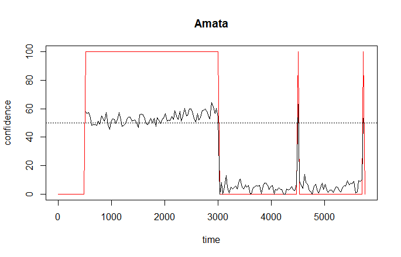
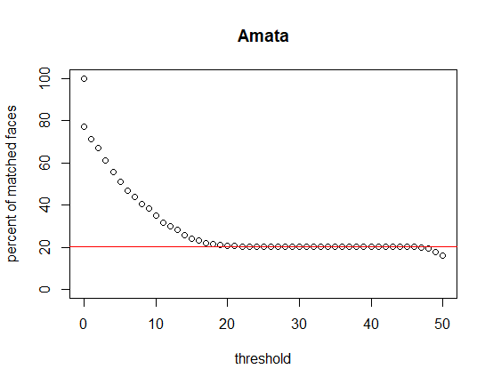
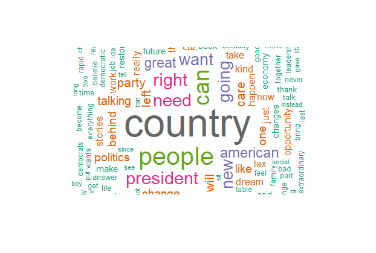
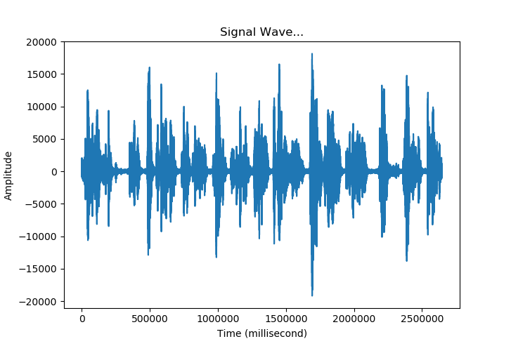
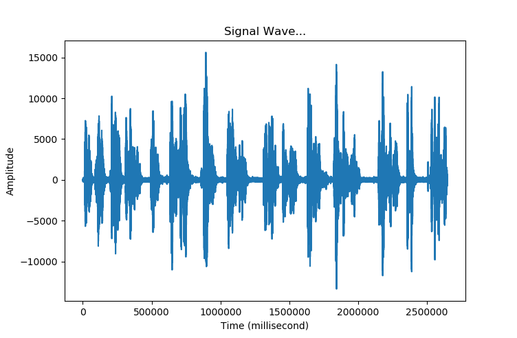
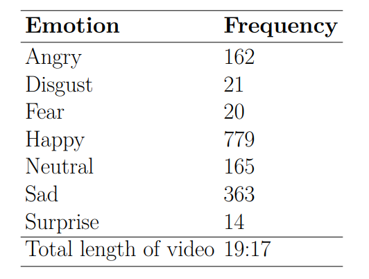

# Motivation
People perceive information not only from text but also from audio and image in communication, but despite their importance, existing research leaves this question unanswered: Do non-textual features of speech affect voters via emotional expression?
* Emotions are important media of political message and powerful tools in communication
* Texts are not enough to capture the non-textual effect of communication 
* Difficulties in systematically measuring speaker's emotion from video data 

# Project 

# Introduction
Consider global warming in speech. The way to convey the exact same word can vary in the context of the speech. However, we are unsure about how various textual and non-textual features of communication affect reception of the information and the perception of speaker. Therefore, I collect 2016 Congressional campaign speech video data from Youtube to use in an experiment in which we can test the effect of emotional expression on those two outcomes. In order to analyze comprehensive aspects of speech in video, we need to analyze text, audio and images from video.

# Overview of literature
* The role of emotions in human behaviors (especially political behaviors): Valentino et al. 2011, Brader 2005
* Computer vision (image): Knox, Lucas and de Benedictis-Kessner 2016, Torres 2018
* Audio: El Ayadi, Kamel and Karray 2011
* Text: Tumasjan et. al. 2010

# Method: the case study
* Download videos from Youtube
  * Crop Youtube videos of 2016 U.S. Congressional elections winners by keywords ("candidate name $+$ campaign speech"). 
  * Download top 3 results of each winners (Total about 60GB as the sample of the project). 

* Video text
  * Cut extracted audio into pieces
  * Run Google Speech API for each audio blocks
  * Transcribe the audio blocks and merge them

* Video audio
  * Extract audio from video
  * Analyze the audio: Amplitude, pitch, length etc.

* Video images
  * Recognize the face of a politician from video
  * Use pre-trained face classifier for detecting emotions (Goodfellow 2013) 
  * Capture and analyze the facial emotions of the politician for each video frames

# Capturing and quantifying emotions from using deep learning
To capture and quantify speaker's emotions from video, I used Real-time face detection and emotion/gender classification using fer2013/IMDB datasets with a keras Convolutional Neural Networks (CNN) model and openCV by [Arriaga, Ploger, and Valdenegro (2017)](https://github.com/oarriaga/face_classification/blob/master/report.pdf). I modified some of the code becuase several functions and packages have been changed since 2017. However, the base model and package are from orriaga's repo [here](https://github.com/oarriaga/face_classification/blob/master/src/train_emotion_classifier.py). The python code that I used is "capture_emotions.py" in this repository.

 # Challenges in capturing "The Speaker"
If a video is a speech of one speaker of my interest, then it will be relatively easy to capture the emotion of speaker to understand her strategical usage of emotions in speech. However, in reality, videos in Youtube does not show just one speaker of my interest. There can be multiple individuals who are not my interests including commentators, panels, reporters or any random individuals. Therefore, I need to find a way to capture the point where the person of my interest gives a speech. 

To achieve this goal, 
 1) I cut frames of a video and capture the face of a speaker of each frame. 
 2) Using Microsoft Face API, I compared the face of each frame with the benchmark of speakers' face that I am interested in.
 3) I record probability of matching between the benchmark face and faces in a frame.
 4) With a probability of a threshold (I can select the threshold), I can decide whether the person of interest (speaker) is in the frame or not. In this case study, I used 50% of confidence rate as the threshold of matching faces. The below plots show the matched frames and varying threshold.
 

 
 5) With this method and frame cut by time mark of video, I can figure out whether the person of interest is speaking in given time frame of a video.
 
The python code that I used is "whose_face.py" in this repository.

# Text
The split audio file can be transcribed in Google Speech API. Text sources are useful data and there are various models to analyze text, but without a video and audio component of speech, we can only understand limited information from the communication. For example, the same word can be presented in different ways with different emotions that text data itself cannot capture that difference. In this post, I will use a case of video. The video is from the Youtube channel of Congressman John K. Delaney (https://www.youtube.com/watch?v=z-NvLskoi7I). Below is the word cloud of the sample video's texts. The python code that I used is "transcribe.py" in this repository.

## Transcript
I used Google Speech API to transcribe text from the Youtube video. The below is the part of transcript of speech in the Youtube.

00:00:00 needs to move their jobs overseas by going to a territorial tax system we want to present and we'll change the tax code to Great incentives for people to invest in communities that have been left behind that is a bipartisan idea 
00:00:15 we want a president we want a president who will change how the government contracts so that it only does business in places that have been left behind economically that is a bipartisan idea instead of ramming down the throat of the American people 
00:00:30 a tax bill that is based on people lying and selling out we need a president to watch to use the tax code to take care of places that have been left behind cuz that's Our obligation need a president who's going to look into the future 
00:00:45 understand what Thomas Friedman's talking about in his book he understands that the world is changing and we need to do something about it we need to make our country more entrepreneurial cuz that's how you succeed in the future we need to make our country more competitive and import 
00:01:00 we need a new social contract the social contract that I succeeded on needs to change we need to repent preparing our kids for totally new world people going to need to be trained across their lives and one job anymore 
00:01:15 going to have for 5 Healthcare in retirement can no longer be linked to employment cuz as long as it is people won't move their job leave their jobs and pursue opportunities right that's the kind of President and that's the kind of leadership 
00:01:30 we need we need a president who doesn't want to repeal the estate tax but wants to expand the Earned Income Tax Credit a bipartisan idea 
00:01:45 what we really need a president to do is to bring us together to restore civility to politics to restore respect for the profession of Public Service  
00:02:00 can actually begin a dialogue about the things we agree on instead of always always talking about the things we don't agree on present 

# Video audio
Speaker's emotions and non-textual implication of message can vary. These variations in audio can be measured by amplitude, pitch, and speed of speech. Although these two audio files are from the same speaker, the amplitude of speech tone differs by the context and message of the speech. For an experiment, I can manipulate the speed, tone or pitch of speech. Based on literature on emotion and speech, amplitude (the intensity of voice) can be translated as the intensity of emotion in a speech (Anderson et al. 2014;
Anderson and Klofstad 2012; Dietrich, Hayes, and O'Brian 2019). For instance, criticizing messages in a speech has negative emotion (i.e. anger) shows higher pitch and/or amplitude. The below is the messages from the videos that shows strong emotions. Remember the two plots have different y axis scale! (From -20,000 to 20,000, From -15,000 to 15,000)

Texts: Even some very significant challenges we should have dealt with but we didn't do it why because hyper partisan politics prevents us from getting anything done.

On the other hand, positive message shows relatively less stronger emotions and has the amplitude is smaller than the negative message.

Text: One of the most sacred fundamental ideals of this country the American dream the notion that if you work hard and you play by the rules you and your family can live a better life.

# Video images
I used \texttt{Emotion} Python package written by Octavio, Valdenegro-Toro, and Pl{\H o}ger (2017). The strength of their package is that it can analyze speaker's facial emotions in real time for every frames based on general convolutional neural network (CNN). The trained classifier for emotion used data set by Goodfellow (2013), and the authors reported that their classifier has an accuracy of 66\% in the FER-2013 emotion dataset comparing to human classifier. Among many videos, I chose one video to analyze its features in detail.

Now to quantify and store the emotions of speaker from a video, I stored captured emotions of each frame of video. The below is the distribution of emotions from the sample video. As it shows there are several points of the speech where the speaker shows strong emotion such as anger. I will discuss and analyze more about these stronger emotions from speech to understand how speaker's emtions can be strategically used for audiences or messages of videos.

  
  

# Conclusion
I will conduct the experiments to identify the effect of emotion in speech via textual and non-textual ways. For instance, 1) we can use similar text with different audio and visual setting to identify high and low emotional expression. 2) We can test how emotional and contextual differences affect receivers' perception and knowledge. 3) With better and more Congressional campaign speech videos, we could build better speaker's emotion classifier and identify different candidates' campaign styles and their effects.

I thank [Chris Lucas](http://christopherlucas.org/) for helpful conversations and comments.
